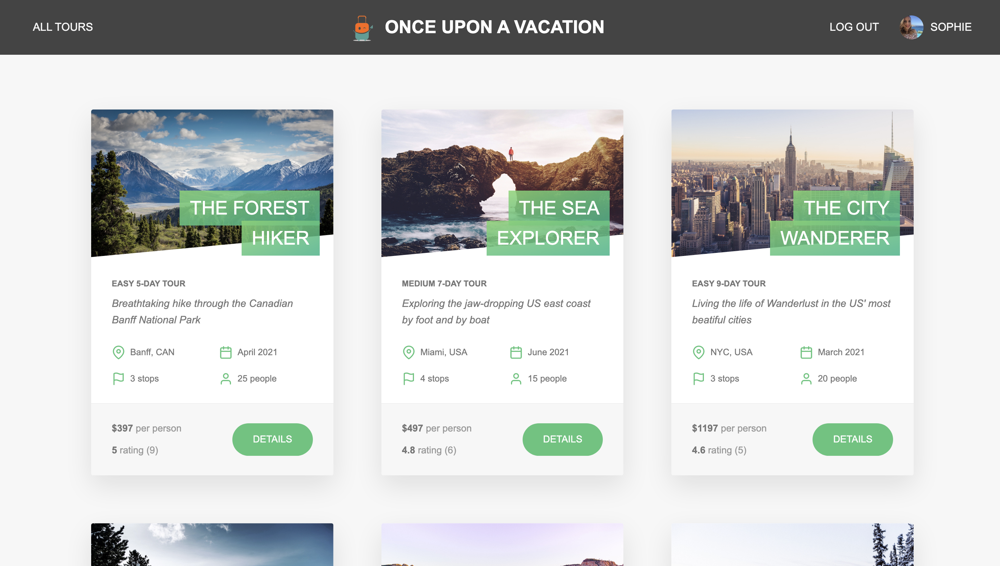

# Once Upon A Vacation

“Once Upon a Vacation” is a full-stack travel platform meticulously crafted with Node.js, Express.js, and MongoDB. Discover dream destinations, book seamless tours, and embark on unforgettable journeys — all in one place! 🌎✈️


<br><br>


## Features 🌟

- Authentication and Authorization (Sign up, Log in, Logout, Update, and reset password)
- User profile (Update username, photo, email, password, and other information)
- Tour (Explore tour packages, Find Details of Each Tour like ratings, guides, etc.)
- Bookings (Make bookings, view past bookings, etc.)

## Technologies Used 💻

- **NodeJS** - JS runtime environment
- **Express** - The web framework used
- **Mongoose** - Object Data Modelling (ODM) library
- **MongoDB Atlas** - Cloud database service
- **Pug** - High performance template engine
- **JSON Web Token** - Security token
- **ParcelJS** - Blazing fast, zero configuration web application bundler
- **Postman** - API testing
- **Mailtrap & Sendgrid** - Email delivery platform
- **Azure App Service** - Cloud platform

## Getting Started 🚀

These instructions will get you a copy of the project up and running on your local machine for development and testing purposes.

### Prerequisites

- Node.js
- npm

### Installation

1. Clone the repo and go to cloned directory
   ```sh
   git clone https://github.com/heymitali/once-upon-a-vacation.git; cd once-upon-a-vacation
   ```
2. Install NPM packages

   ```sh
   npm install
   ```

3. Copy Paste `sample-config.env` and create new file `config.env` with updated credentials.

4. Build and Start the server

   ```sh
   npm run build:js; npm start
   ```

5. Open your browser and navigate to http://localhost:3000

## Links

- Live Website: https://once-upon-a-vacation.azurewebsites.net/
